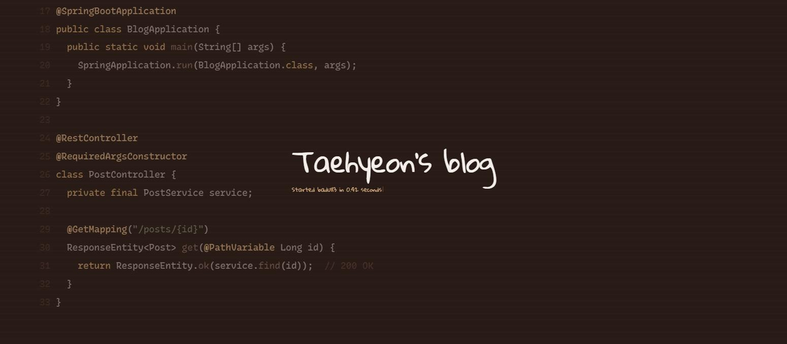

<p align="center">
  <a href="https://badul13.github.io"></a>
</p>

<p align="center">실무 학습 및 개인 공부 기록용 블로그</p>

## 구성

| 갈래 | 위치 | 내용 |
|---|---|---|
| Posts | `src/content/posts` | 기술 글 |
| Study | `src/content/study` | 개인 공부 기록 |
| Work | `src/content/work` | 실무 학습 기록 |
| Diary | `src/content/diary` | 일기 |

- Astro 5로 빌드하고, `main`에 푸시하면 GitHub Actions가 GitHub Pages에 배포합니다.

## 로컬 실행

```sh
npm install
npm run dev
```

## 폰트

- [Pretendard](https://github.com/orioncactus/pretendard), [Recursive](https://github.com/arrowtype/recursive), [Gloria Hallelujah](https://fonts.google.com/specimen/Gloria+Hallelujah) — SIL OFL 1.1
